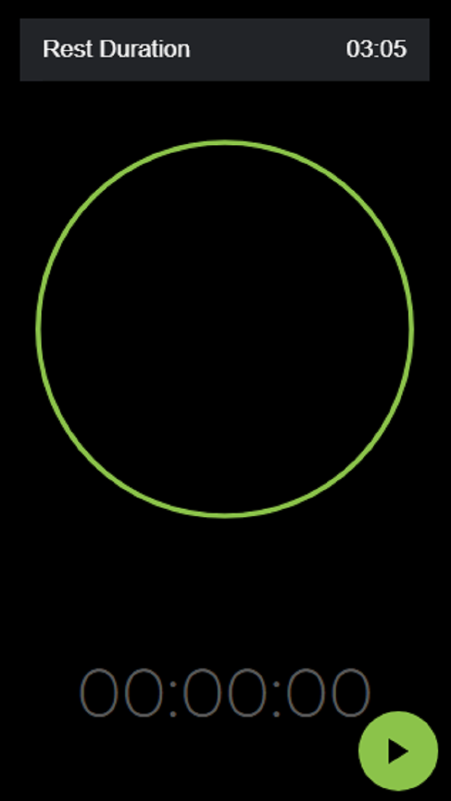
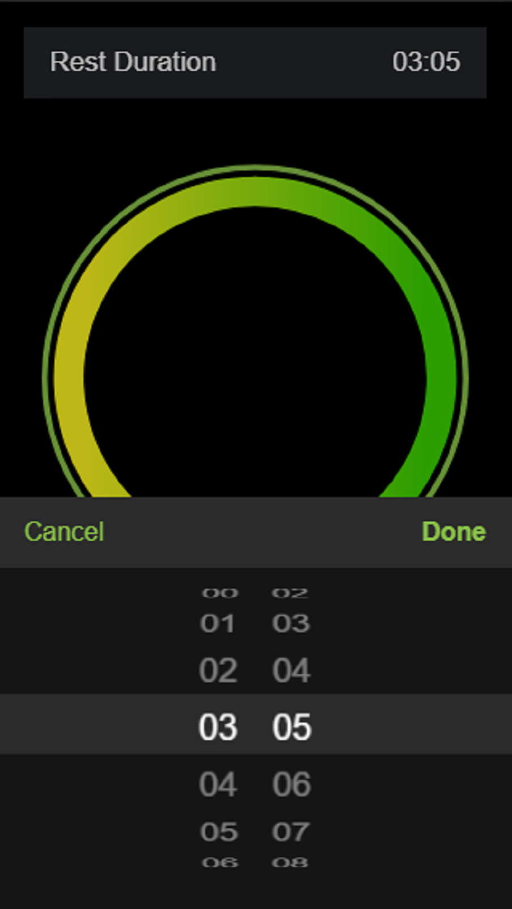
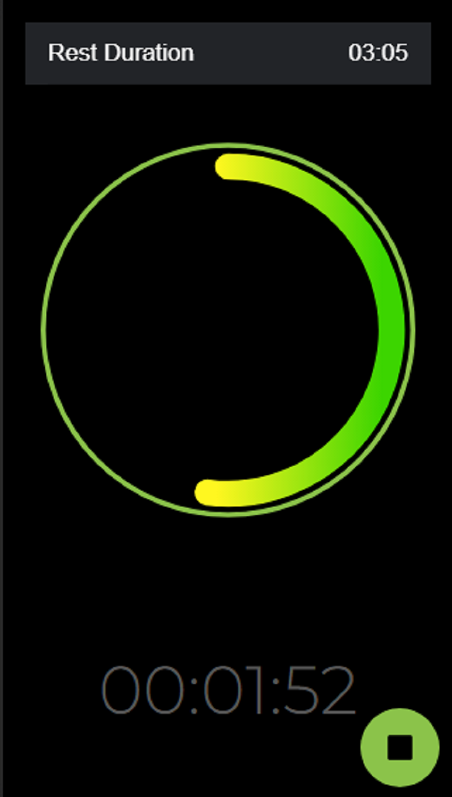

# Ionic Angular Rest Duration Application

This application gives you a beautiful count down timer for your rest durations between sets in workouts or anything else that you need to take some time off to refresh.

## Table of Contents
- [Getting Started](#getting-started)
- [App Preview](#app-preview)
- [Deploying](#deploying)
  - [Progressive Web App](#progressive-web-app)
  - [Android](#android)
  - [iOS](#ios)

## Getting Started

* [Download the installer](https://nodejs.org/) for Node.js 6 or greater.
* Install the ionic CLI globally: `npm install -g ionic`
* Clone this repository: `git clone https://github.com/kiptechie/ttime.git`.
* Run `npm install` from the project root.
* Run `ionic serve` in a terminal from the project root.
* Enjoy. :tada:

_Note: See [How to Prevent Permissions Errors](https://docs.npmjs.com/getting-started/fixing-npm-permissions) if you are running into issues when trying to install packages globally._

## App Preview

All app preview screenshots were taken by running `ionic serve` on google chrome browser.

- [Home Page](https://github.com/kiptechie/ttime/blob/master/src/app/home/home.page.html)

    
  
  
    
 - [Time Picker `mm:ss`](https://github.com/kiptechie/ttime/blob/master/src/app/home/home.page.html)
 
 
 
    
    
    
     
 - [Circular Progress bar](https://github.com/kiptechie/ttime/blob/master/src/app/home/home.page.html)

   
   
   

## Deploying

### Progressive Web App

1. Un-comment [these lines](https://github.com/kiptechie/ttime/blob/d67f90d5c6f85695edd801ffd826a899d369cbad/src/index.html#L20)
2. Run `npm run ionic:build --prod`
3. Push the `www` folder to your hosting service

### Android

1. Run `ionic cordova run android --prod`

### iOS

1. Run `ionic cordova run ios --prod`
